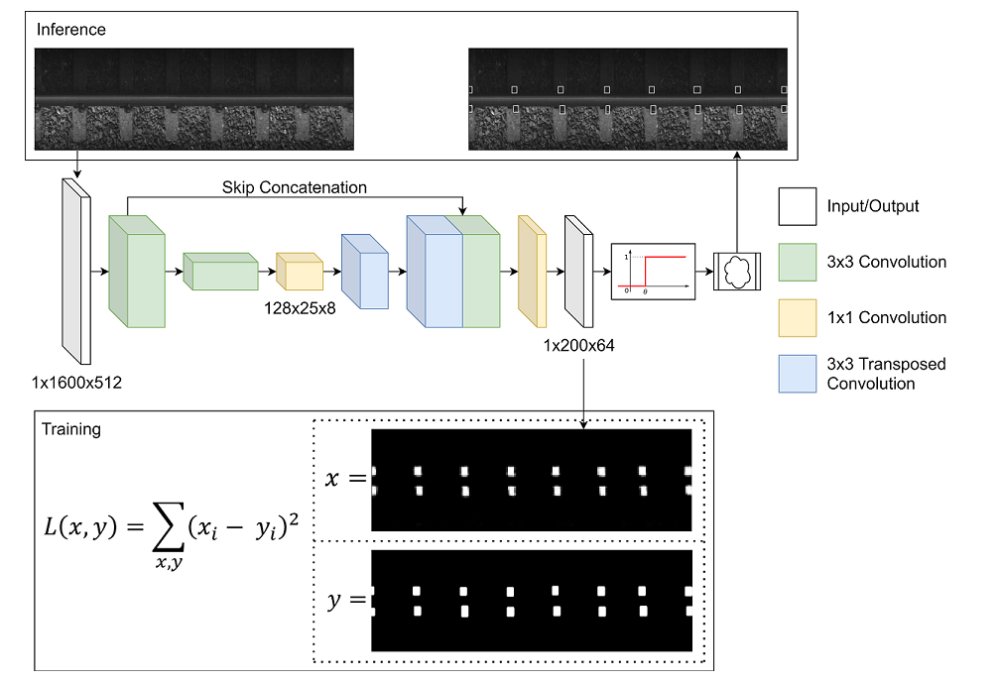

# FasteNet - A fast railway fastener detection algorithm

Implementation of FasteNet fastener detection algorithm, scalable to other applications with similar problem structure.

Code for the paper:

    @article{
        tai2020fastenet,
        title={FasteNet: A Fast Railway Fastener Detector},
        author={Tai, Jun Jet and Innocente, Mauro S and Mehmood, Owais},
        journal={arXiv preprint arXiv:2012.07968},
        year={2020}
    }
    
## Abstract

In this work, a novel high-speed railway fastener detector is introduced. This fully convolutional network, dubbed FasteNet, foregoes the notion of bounding boxes and performs detection directly on a predicted saliency map. Fastenet uses transposed convolutions and skip connections, the effective receptive field of the network is 1.5× larger than the average size of a fastener, enabling the network to make predictions with high confidence, without sacrificing output resolution. In addition, due to the saliency map approach, the network is able to vote for the presence of a fastener up to 30 times per fastener, boosting prediction accuracy. Fastenet is capable of running at 110 FPS on an Nvidia GTX 1080, while taking in inputs of 1600×512 with an average of 14 fasteners per image.

## Prerequisites
- Python 3.8.4
- Pytorch 1.7.1
- OpenCV2 4.4.0
